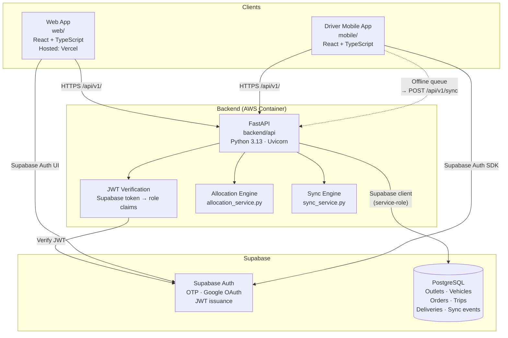
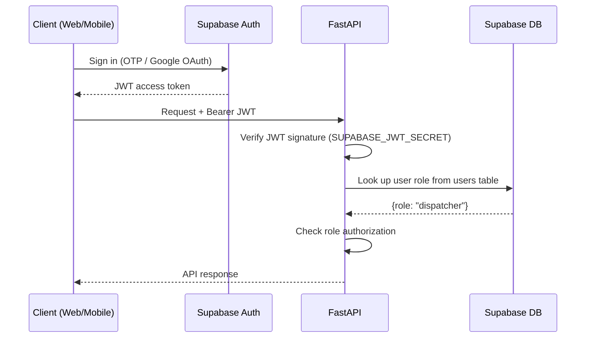
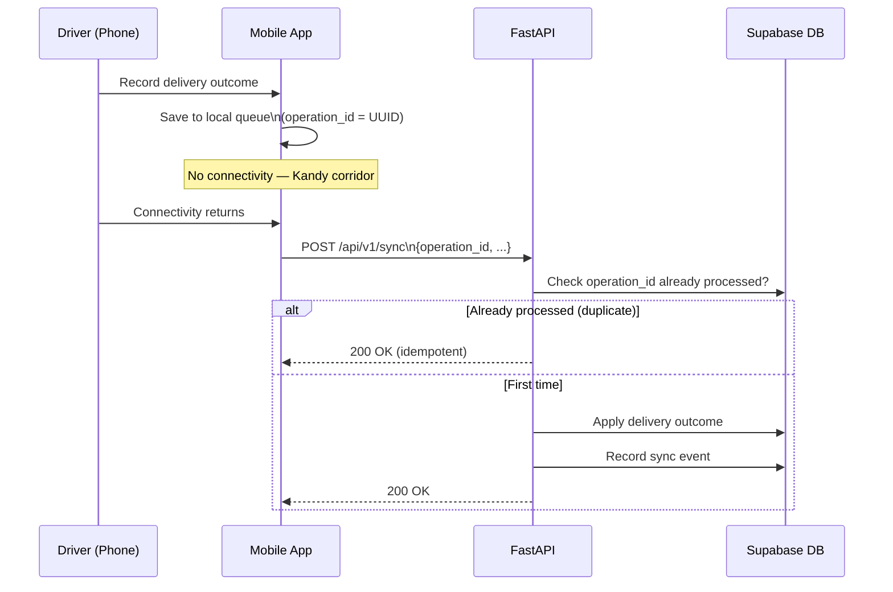

# System Architecture — Waypoint

*Error404 · Tech-Triathlon 2026 · Hackathon submission*

---

## Overview

Waypoint is a delivery planning and operational system for **Waypoint Group**, serving three retail brands across 120 outlets via a fleet of 60 vehicles from two depots (Peliyagoda and Kandy).

The system supports four user roles: **Dispatcher**, **Loader**, **Driver**, and **Store Manager**, across a responsive web app and a mobile app.

---

## High-Level Architecture



---

## Authentication Flow



---

## Offline Sync Flow (Driver)



---

## Components

### Frontend — `web/` (Vite + React + TypeScript)
- **Dispatcher**: Plan creation, vehicle allocation, live board, capacity forecast
- **Loader**: Load list, reverse-unload order, shortfall recording
- **Store Manager**: Order placement, delivery status, receipt confirmation

### Mobile App — `mobile/` + `mobile-native/`
- **Driver**: Route view, stop delivery recording, proof of delivery, offline mode, sync

### Backend API — `backend/api/` (FastAPI)
| Module | Responsibility |
|---|---|
| `core/config.py` | Environment-validated settings |
| `core/exceptions.py` | Centralised error handling |
| `api/deps.py` | JWT auth + role enforcement |
| `api/routes/` | Thin HTTP handlers |
| `services/allocation_service.py` | Planning engine (constraint-based) |
| `services/delivery_service.py` | Delivery state machine |
| `services/sync_service.py` | Idempotent offline sync |
| `repositories/` | Data access layer |

### Database — Supabase PostgreSQL
See [`data-model.md`](data-model.md) for full ERD.

### Hosting
| Component | Platform |
|---|---|
| Web frontend | Vercel |
| Backend API | AWS ECS / container |
| Database + Auth | Supabase |

---

## API Design

All application routes versioned at `/api/v1/`.

| Route group | Prefix |
|---|---|
| Health | `GET /health` |
| Auth | `/api/v1/auth/` |
| Orders | `/api/v1/orders/` |
| Outlets | `/api/v1/outlets/` |
| Vehicles | `/api/v1/vehicles/` |
| Planning | `/api/v1/planning/` |
| Trips | `/api/v1/trips/` |
| Deliveries | `/api/v1/deliveries/` |
| Offline Sync | `POST /api/v1/sync` |

See [`api-contract.md`](api-contract.md) for full request/response schemas.

---

## Deployment

```bash
# Full local stack
docker compose up

# Backend only
cd backend/api
uvicorn app.main:app --reload --port 8000
```
