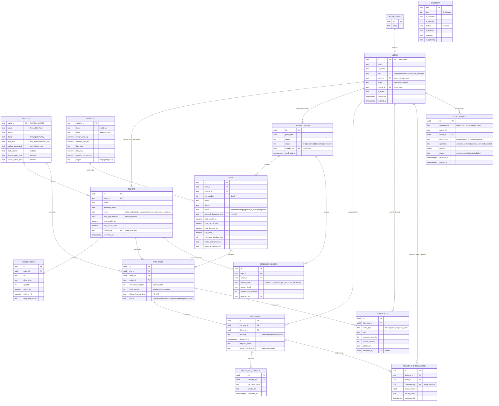

# Data Model — Waypoint

*Error404 · Tech-Triathlon 2026*

---

## Entity Relationship Diagram



---

## Table Summary

| Table | Rows (expected) | Source |
|---|---|---|
| `outlets` | 120 | `outlets.csv` |
| `vehicles` | 60 | `vehicles.csv` |
| `calendar` | ~500+ dates | `calendar.csv` |
| `users` | 4 (demo) | Seed script |
| `orders` | Dynamic | Store managers |
| `order_items` | Dynamic | Store managers |
| `delivery_plans` | 1 per depot per day | Dispatcher |
| `trips` | ≤120/day (max 2/vehicle) | Allocation engine |
| `trip_stops` | Dynamic | Allocation engine |
| `deferred_orders` | Dynamic | Allocation engine |
| `deliveries` | 1 per stop | Driver |
| `proof_of_delivery` | 1 per delivery | Driver |
| `shortfalls` | Dynamic | Loader |
| `receipt_confirmations` | 1 per delivery | Store manager |
| `sync_events` | 1 per offline op | Sync engine |

---

## Key Constraints (from challenge brief)

| Constraint | Enforced in |
|---|---|
| Vehicle weight/volume capacity | Allocation engine + trip_stops |
| Refrigerated requirement (chilled orders) | `vehicles.temp = 'reefer'` check |
| Van-only outlet access | `outlets.parking_constraint = 'van_only'` |
| Max 2 trips per vehicle per day | `trips.trip_number IN (1,2)` + UNIQUE |
| Delivery windows | Allocation engine + `outlets.window_*` |
| Weekly fuel quota | Calculated per vehicle per week |
| Fresh window (3:30–8:00 AM) | Allocation engine budget check |
| Style/Tech window (trading day, 480 min) | Allocation engine budget check |

---

## Migrations

| File | Description |
|---|---|
| `supabase/migrations/001_initial_schema.sql` | All 15 tables + indexes + triggers |
| `supabase/migrations/002_rls_policies.sql` | Row-Level Security per role |

## Seed

```bash
cd backend/api
py ../../scripts/seed.py
```

Place `outlets.csv`, `vehicles.csv`, `calendar.csv` in `data/` first.
